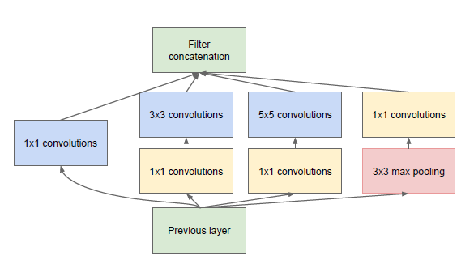

# GoogLeNetのChainerモデル
## 学習済みGoogLeNetを試す

以下のコマンドで、指定したURLの画像をダウンロードし、その画像の分類結果を出力する。

```
python googlenet_predict.py -u http://find-travel.cdn-dena.com/picture/articlebody/38214
```

`-u`オプションは省略可能。


## Inception Module構造

Inception ModuleはGoogLeNetの基本的概念。通常のConvolution層では、32×32のような決まったサイズのフィルタをn枚(例えば128枚)使用し、出力もnチャンネル(128チャンネル)になる。これに対し、GoogLeNetのInception Module層では、1×1フィルタが64枚、3×3フィルタが32枚、5×5フィルタが16枚、poolingフィルタが16枚のように、複数種のフィルタを用意し、そのフィルタリング結果を結合して、nチャンネル(128チャンネル)の出力を生成する。(サイズの異なるフィルタでも、出力画像のサイズが同じになるように、strideとpaddingでサイズ調整される)


## GoogLeNet構造
Convolution、Pooling、Inception Moduleの組合せで構成されたニューラルネットワーク。訓練時にはloss1、loss2、loss3で3つの誤差を計算してる。それぞれの計算結果を重み付けて、

```
loss = (loss1 + loss2) * 0.3 + loss3
```

として、最終誤差にする。なお、loss1とloss2への分岐は、学習時のみに使用するネットワークで、学習後の本番適用時では、loss3のみを使って画像のクラスタリングを行う。


## GoogLeNetのチューニング
チューニングでは以下のファイルを使う。

```
tuned_googlenet.py # ファインチューニングするGoogLeNetの構造定義
convert_caffe_model.py # caffe_modelから、学習済みパラメータをchainerのモデルへコピーして、chainerのモデルとして保存するスクリプト。
tuned_googlenet.model # convert_caffe_model.pyで出力されるchainerのモデル(パラメータ設定済み)
train_googlenet.py # tuned_googlenet.modelを読み込んで、学習を行う。

```

まずは `tuned_googlenet.py` を編集してニューラルネットワークの構成を変える。CNNでは深層に行くほど画像の根本的な特徴量が抽出されるので、基本的に出力層に近いレイヤーだけ取り替えればOK。ここでは、全inception module層の学習済みパラメータを固定し、以下の層のみ取り替えて再学習を行わせる。

- 分岐点1のloss1\_conv層、loss1\_fc1層、loss1\_fc2層
- 分岐点2のloss2\_conv層、loss2\_fc1層、loss2\_fc2層
- 出力層のloss3\_fc

これらの層のlink及びユニット数などを解くべき問題に合わせて修正した後、以下のコマンドを実行すれば、必要最小限の学習済みのパラメータが設定されたgooglenetのchainerモデルが作られる。

```
python convert_caffe_model.py
```

設定済みのchainerモデルファイルは、`tuned_googlenet.model` という名前で出力される。ここの変換では具体的に、caffeのmodel zooにあるオリジナルの学習済みモデル(bvlc_googlenet.caffemodel)から、学習済みパラメータをchainer側のモデルにコピーしている。(チューニングしようとしてるレイヤー以外)

あとは、 `train_googlenet.py` で、chainer側のモデルを読み込んで好きに学習させればOK。

※ちなみに、`tuned_googlenet.py` のモデル定義ファイルでは、誤差逆伝播をfc層で止めるために、__call__の順伝播処理内でvolatileフラグを使って計算履歴を削除している。volatile = Trueとすれば、そこから先の計算ではhistoryに残らず、backwardする際に逆伝播が止まる。volatile = Falseにすると、そこから先は順伝播のhistoryが残るので、backwardする際にWとbの勾配計算が行われる仕組み。